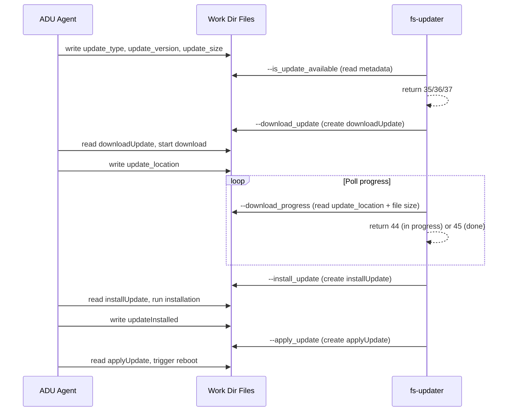
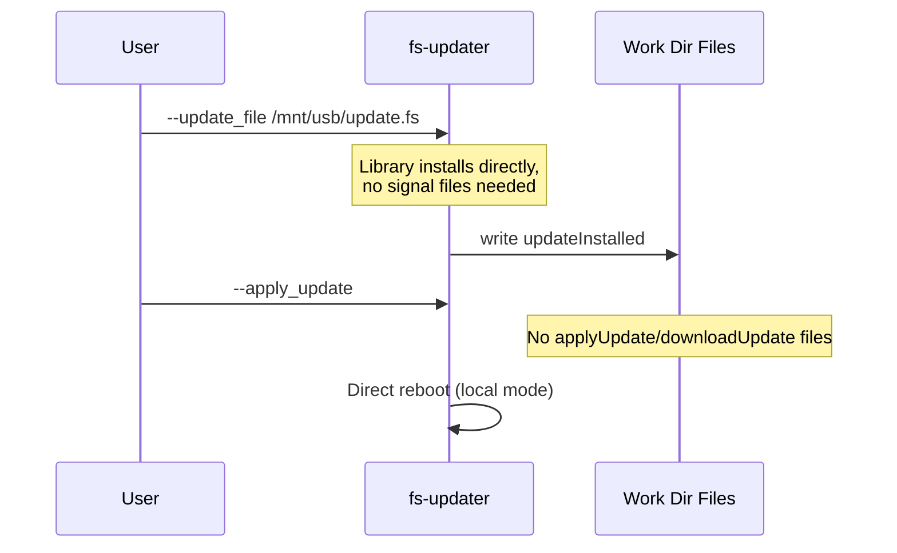
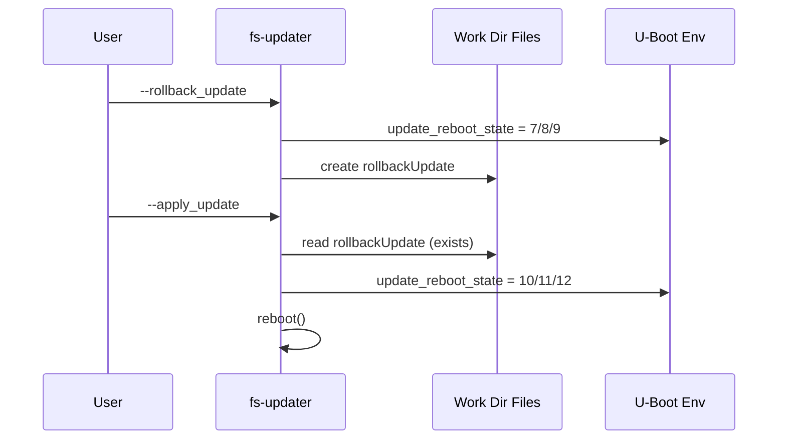

# Signal Files

Work directory: `/tmp/adu/.work/` (default, `TEMP_ADU_WORK_DIR`)

## File Overview

| File | Type | Created By | Read By | Purpose |
|------|------|------------|---------|---------|
| `update_type` | Metadata | ADU agent | `--is_update_available` | "firmware", "application", or both |
| `update_version` | Metadata | ADU agent | `--is_update_available` | Version string |
| `update_size` | Metadata | ADU agent | `--is_update_available`, `--download_progress` | Size in bytes |
| `update_location` | Metadata | ADU agent | `--download_progress` | Path to downloading file |
| `downloadUpdate` | Signal | `--download_update` | `--download_progress`, ADU agent | Trigger download |
| `installUpdate` | Signal | `--install_update` | ADU agent | Trigger installation |
| `updateInstalled` | Signal | ADU agent / library | `--install_update`, `--apply_update` | Installation complete |
| `applyUpdate` | Signal | `--apply_update` | ADU agent | Trigger apply (network mode) |
| `rollbackUpdate` | Signal | `--rollback_update`, `--switch_*_slot` | `--apply_update` | Rollback prepared |

## Network Update Pipeline

## Local Update Flow

## Rollback Signal Flow

