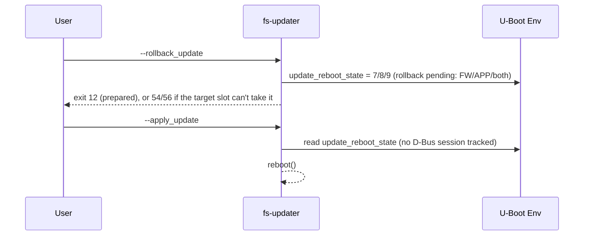

# D-Bus Session Protocol

This page documents what the CLI's Category A/C flags
([CLI Reference](../reference/cli.md)) literally do over the
`de.fsembedded.fsupdate1` bus: useful for manual/scripted use, or for an
integrator writing something other than the ADU handler. For the full
interface contract (every method, property, signal, error name, and the
stability rules around them) see the interface definition,
`dbus/de.fsembedded.fsupdate1.xml`, in `fs-updater-service`; this page does
not repeat it.

**The ADU handler does not use most of these CLI steps.** It is its own
direct D-Bus client and calls `StartDownload`/`StartInstall`/`Apply` itself
— see [Azure Device Update Integration](azure-device-update.md#adu-lifecycle--integration-mapping).
The diagrams below show the CLI driving the same calls, for the case where
nothing else is.

There is no file-based signalling anywhere in this protocol — every step
below is a D-Bus call or a property/signal read.

## Session token

`StartDownload` (or `InstallLocal`, for a local install) returns a `session_id`
that every later call in the same cycle passes back, and that terminal
signals carry for correlation. `session_id = 0` is never issued and marks
"no session" in `SessionId`/`GetState()`. The session is service-local,
in-memory state: it does not survive a service restart (the counter resets
to 1), and nothing in this CLI or in the ADU handler currently calls
`GetState()` to detect and recover from that — see the interface's own
stability notes on `GetState()` for the recovery pattern it is designed to
support.

## Network update pipeline

The CLI does not fetch anything itself here — a separate caller (a D-Bus
client such as the ADU handler, or a script using the same bus calls) owns
`StartDownload`/`FinishDownload`. The CLI flags below only **observe** that
session; `--download_update` does not start a download, and the
no-path form of `--install_update` only *advances* an install the other
caller already staged — it does not fetch or verify the payload itself.

```mermaid
sequenceDiagram
    participant Downloader as Download owner (e.g. ADU handler, or a script)
    participant Svc as fs-updater-service (D-Bus)
    participant CLI as fs-updater CLI

    Downloader->>Svc: StartDownload(type, version, size) -> session_id
    Downloader->>Svc: FinishDownload(session_id, success, payload_path)

    CLI->>Svc: --is_update_available (CheckUpdateAvailable)
    CLI-->>CLI: return 35/36/37, or 34 if none

    CLI->>Svc: --download_update (read DownloadState)
    CLI-->>CLI: return 40 if in_progress, else 38

    loop Poll progress
        CLI->>Svc: --download_progress (read DownloadState/DownloadProgress)
        CLI-->>CLI: return 44 (in progress), 45 (done), or 42 (idle/failed)
    end

    CLI->>Svc: --install_update, no path (StartInstall(session_id, type))
    CLI-->>CLI: return 47 (accepted; poll --install_progress)

    loop Poll progress
        CLI->>Svc: --install_progress (read InstallState/InstallProgress)
        CLI-->>CLI: return 48 (finished), 49 (failed), or 47 (running)
    end

    CLI->>Svc: --apply_update (Apply)
    Svc-->>CLI: reboot_required
    CLI-->>CLI: reboot(2) if required
```

The no-path `--install_update` call above needs `DownloadState == "finished"`
plus a readable `SessionId` and `UpdateType` — all set by the download
owner's `FinishDownload`; without them it reports 46 (nothing queued)
instead of calling `StartInstall`.

## Local update flow

`--install_update <path>` (or a bare trailing path) mints its own session
via `InstallLocal` and, by default, blocks on the outcome itself instead of
requiring a separate `--install_progress` poll loop.

```mermaid
sequenceDiagram
    participant User
    participant CLI as fs-updater
    participant Svc as fs-updater-service (D-Bus)

    User->>CLI: --install_update /mnt/usb/update.fs
    CLI->>Svc: InstallLocal(path) -> session_id
    Svc-->>CLI: InstallProgress (PropertiesChanged, repeated)
    Svc-->>CLI: InstallCompleted(session_id, success, message)
    CLI-->>User: exit 0/4/8 (success) or 3/7/11 (failure), by type

    User->>CLI: --install_update /mnt/usb/update.fs --detach
    CLI->>Svc: InstallLocal(path) -> session_id
    CLI-->>User: exit 47, "session <id>; poll --install_progress"

    User->>CLI: --apply_update
    CLI->>Svc: Apply()
    Svc-->>CLI: reboot_required
    CLI-->>CLI: reboot(2) if required
```

If the blocking wait sees no progress for its idle timeout, or loses the
D-Bus watch, the CLI stops waiting and exits 47 without a verdict: the
install may still be running, and `--install_progress` reports its outcome.

## Rollback and slot-switch flow

`--rollback_update`, `--switch_fw_slot`, and `--switch_app_slot` are local
durable-state operations against the library — no D-Bus call. `--apply_update`
is the only step here that talks to the service, and only when it has no
D-Bus install of its own to finish; otherwise it reads the durable
`update_reboot_state` directly through the library and reboots from there.



After the reboot, `--commit_update` finalises the rollback (exit 16) or
settles a state the current flow no longer writes (exit 58/59 — see
[Return Codes](../reference/return-codes.md#commit---commit_update)).
