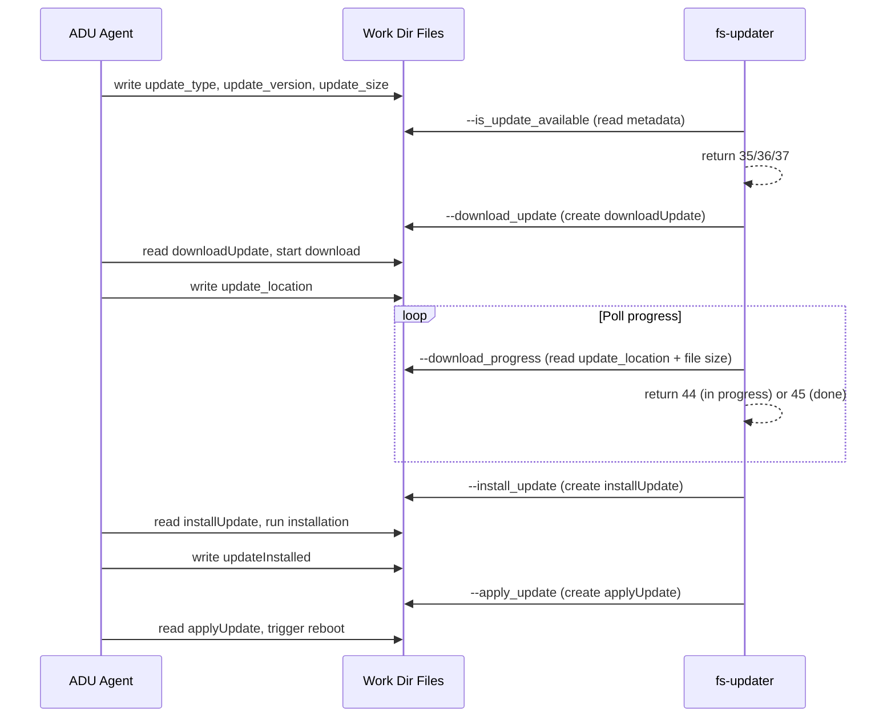
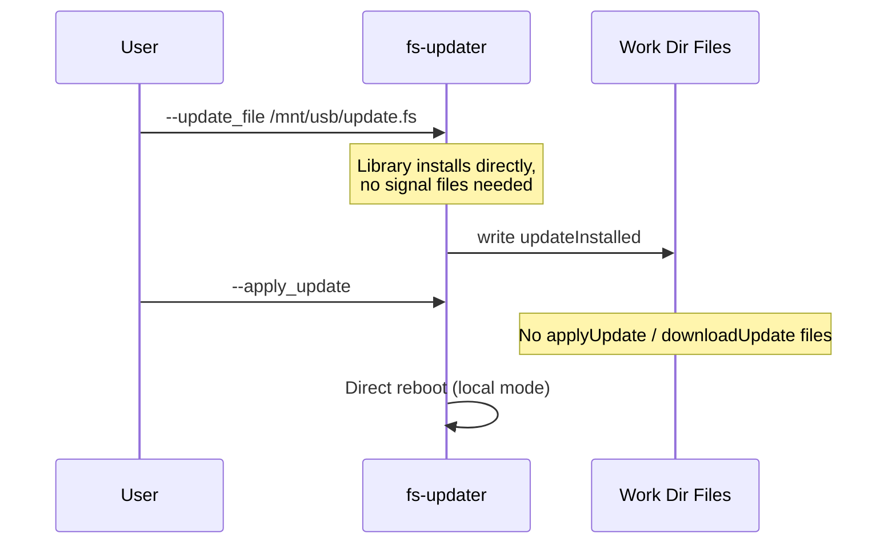
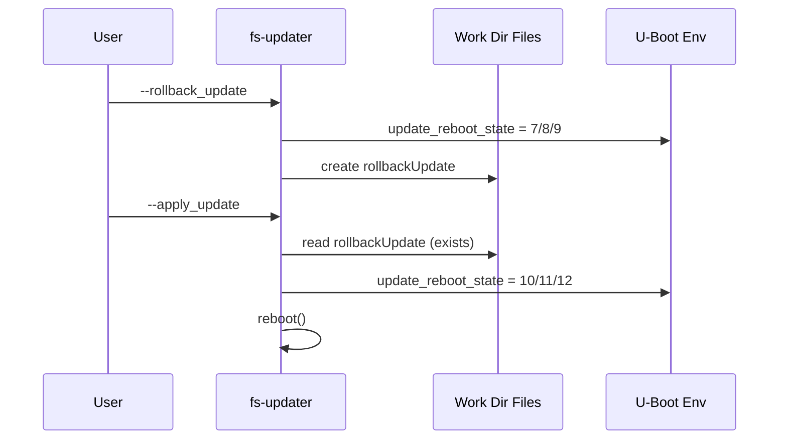

# Signal Files

Work directory: `/tmp/adu/.work/` (default, controlled by `TEMP_ADU_WORK_DIR`).

Signal files are the IPC mechanism between the ADU agent and the CLI's
Category C arguments (`--is_update_available`, `--download_update`,
`--download_progress`, `--install_update`, `--apply_update`). These arguments
have no direct library interaction — they read and create files in the work
directory.

## File overview

| File | Created by | Read by | Purpose |
|------|------------|---------|---------|
| `update_type` | ADU agent | `--is_update_available` | `"firmware"`, `"application"`, or `"both"` |
| `update_version` | ADU agent | `--is_update_available` | Version string of the pending update |
| `update_size` | ADU agent | `--is_update_available`, `--download_progress` | Expected file size in bytes |
| `update_location` | ADU agent | `--download_progress` | Path to the file being downloaded |
| `downloadUpdate` | `--download_update` | ADU agent | Signal: start the download |
| `installUpdate` | `--install_update` | ADU agent | Signal: run the installation |
| `updateInstalled` | ADU agent / lib | `--install_update`, `--apply_update` | Installation complete |
| `applyUpdate` | `--apply_update` | ADU agent | Signal: trigger apply (network mode) |
| `rollbackUpdate` | `--rollback_update`, `--switch_*_slot` | `--apply_update` | Rollback prepared |

## Network update pipeline

## Local update flow

Local `--update_file` installs directly via the library; no signal files are
created except `updateInstalled` on completion.

## Rollback signal flow

